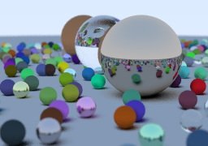

# raytracer

A simple raytracer based on the book "Ray Tracing in One Weekend" by Peter Shirley.
Mainly to refamiliarize myself with CUDA.

TODO:
- [x] Basic ray tracing in C++
- [ ] Rewrite in CUDA
- [ ] Rewrite in JAX
